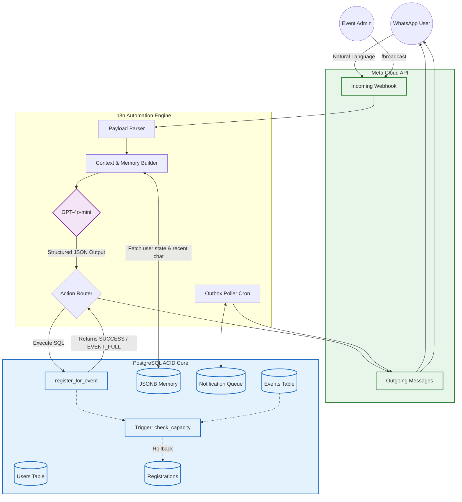

<div align="center">
  
# 🤖 EventFlow-AI: High-Scale WhatsApp Event Orchestrator

[](https://python.org)
[](https://postgresql.org)
[](https://openai.com)
[](https://n8n.io)
[](https://developers.facebook.com/docs/whatsapp)

**An enterprise-grade, transaction-safe AI chatbot architecture designed to handle thousands of concurrent participants for complex, multi-track events entirely over WhatsApp.**

</div>

---

## 🌟 Executive Summary

**EventFlow-AI** was fundamentally designed to solve the chaos of large-scale event logistics. Originally deployed for a 3-day youth convention with 4,000+ participants across 50 distinct sub-events, this system moves far beyond a simple Q&A bot. 

It acts as a fully automated registrar, logistical guide, and remote administration dashboard. By intentionally offloading critical concurrency logic (like capacity limits and race conditions) to deep **PostgreSQL triggers and stored procedures** rather than flimsy middle-tier logic, the system guarantees zero overbooking even when hit by hundreds of users simultaneously.

### 📈 Scale & Impact
- **Supported Load:** 4,000 active participants.
- **Event Capability:** Managed 50 concurrent sub-events and master venue logic.
- **Zero Race Conditions:** 100% capacity safety via SQL `SERIALIZABLE` isolation and unique constraints.
- **Cost Efficiency:** Maintained LLM costs at an incredible **<$12** for the entire 3-day event through aggressive token management.

---

## 🏗️ Deep System Architecture

The core philosophy of EventFlow-AI is **"LLM for NLP, Database for Logic."** The AI is never trusted to calculate availability; it merely parses natural language intent into structured system commands.



---

## 🛠️ Core Engineering Features

### 1. Database-Level Capacity Guarantees (ACID)
When managing 4,000 users vying for 50 event spots, API-level capacity checks result in brutal race conditions and severe overbooking. 
EventFlow-AI implements registration logic via a pure **PostgreSQL Stored Function** (`register_for_event`). Before insertion, a trigger dynamically locks the event row, verifies capacity, and strictly enforces uniqueness. The database yields highly actionable JSON error codes (`EVENT_FULL`, `ALREADY_REGISTERED`) back to the AI, which subsequently generates a friendly apology or confirmation to the user.

### 2. Radical Token Efficiency (Hybrid Memory)
LLM token costs explode when feeding complete chat histories into prompts. EventFlow-AI utilizes a unique **Rolling Summary + Sliding Window** approach:
- A background worker condenses deep history into a dense summary string.
- Only the 5 most recent messages are injected dynamically.
- State is serialized perfectly into a `JSONB` column, keeping API calls impossibly cheap without sacrificing conversation coherence.

### 3. Asynchronous Outbox Pattern
Instead of fragile, timed loops in server memory, scheduled messages (e.g., "Event starts in 10 minutes" or "Lunch is served at Hall B") are committed to a PostgreSQL `Outbox Queue` table with a `deliver_at` timestamp. An n8n cron node polls this table asynchronously, ensuring absolute reliability and zero dropped messages even during deployments.

### 4. Zero-Code Admin Toolkit
Event administrators can manage the entire system natively through their personal WhatsApp. By authenticating phone numbers against an `admins` table, the AI unlocks hidden tools, permitting admins to create events, inject global mass announcements, and fetch live turnout analytics on the fly.

---

## 💻 Tech Stack Deep Dive

| Layer | Technology | Justification |
|-------|------------|---------------|
| **Brain** | OpenAI `gpt-4o-mini` | Perfect balance of low latency, cost efficiency, and strict JSON-following behavior. |
| **Logic/State** | PostgreSQL | Handles complex joins, robust JSONB manipulation, robust triggers, and ACID compliance. |
| **Piping** | n8n (v1.119.1) | Rapid prototyping of webhook endpoints and complex API branching without heavy boilerplate. |
| **Interface** | WhatsApp Cloud API | Ubiquitous user adoption; zero-friction onboarding for event attendees. |

---

## 🚀 Setup & Deployment

1. **Database Initialization:**
   Run the provided (sanitized) SQL scripts against your PostgreSQL 15+ instance.
   ```bash
   psql -h localhost -U postgres -d event_db -f sql.txt
   ```

2. **n8n Orchestration Import:**
   Navigate to your local or hosted n8n instance and import the workflow definitions found in the `/n8n_workflows` directory.

3. **Environment Credentials:**
   Within n8n, configure your global credential nodes for:
   - OpenAI API Token
   - PostgreSQL connection strings
   - Meta WhatsApp App secrets

4. **Webhook Registration:**
   Register the generated n8n webhook URL within your Meta Developer Dashboard for incoming WhatsApp messages.

---
*Architected and Deployed by JAI J — AI Applications & Automation Engineer*
