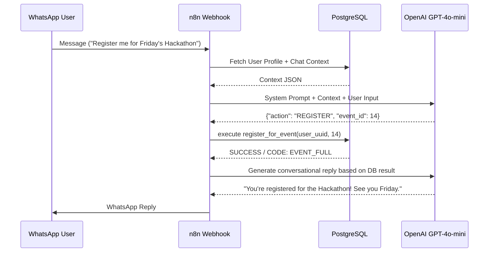

# EventFlow-AI

EventFlow-AI is a production-ready, AI-driven WhatsApp chatbot architecture designed to handle large-scale events. Built originally for the JITO Youth 3-day multi-venue event, the system managed event discovery, capacity-safe registrations, and logistical queries for 4,000+ participants across 50 different events over WhatsApp.

## Key Features

- **Capacity-Safe Registrations:** Uses strict PostgreSQL transactions and triggers—not application logic—to enforce event capacity limits, returning granular JSON error codes (`EVENT_FULL`, `ALREADY_REGISTERED`) to prevent data corruption under heavy concurrent loads.
- **Structured Action Routing:** Uses `gpt-4o-mini` with forced JSON outputs to parse natural language user messages into concrete system actions (`REGISTRATION`, `CANCELLATION`, `INFO`, `FAQ`).
- **Token-Efficient Memory:** Employs a hybrid conversation storage model (Rolling Summary + Finite Recent Messages window) serialized to `JSONB` to maintain context without blowing up LLM prompt sizes.
- **Admin Dashboarding:** Authenticated admin workflows built over WhatsApp for real-time event status checking, mass announcements, and ad-hoc event postponements.
- **Async Notifications:** A decoupled notification outbox pattern for delayed deliveries and event-start reminders.

## Technology Stack

- **Conversation Engine:** OpenAI `gpt-4o-mini`
- **Orchestration:** n8n (v1.119.1)
- **Messaging Layer:** Meta WhatsApp Cloud API
- **Database:** PostgreSQL (with RLS, Views, complex Functions and Triggers)

## System Flow

## Repository Structure

- `/docs`: Technical deep dives on architecture, memory management, and notification flow.
- `/n8n_workflows`: Exported n8n workflow JSON files replicating the core logic (Webhooks, Cron triggers, Database nodes).
- `sql.txt`: Database schema creation scripts, stored procedures, and triggers (Sanitized).

## Setup

1. Import the `.json` workflows into a fresh n8n instance.
2. Execute the `sql.txt` schema on your PostgreSQL instance.
3. Configure your Meta API App and provide webhooks endpoints from n8n.
